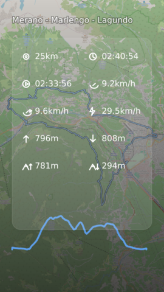
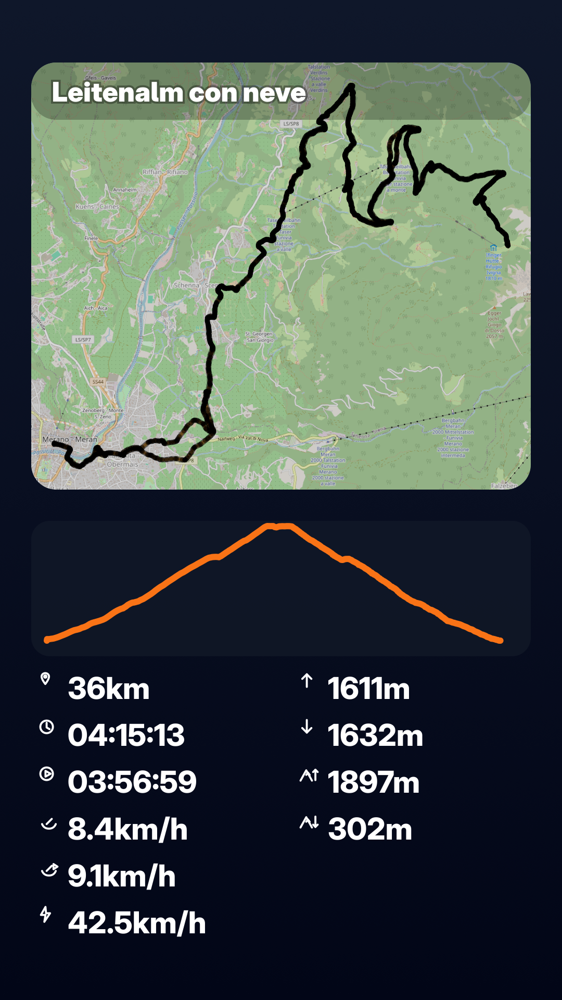

# bicit

`bicit` generates a shareable ride summary image from a GPX track.

Pipeline:
1. Parse GPX and compute stats (distance, time, speed, elevation)
2. Render an OSM map snapshot with Galileo
3. Inject values into an SVG template using element `id`s
4. Export SVG to PNG using resvg library

There are 3 packages:
1. bicit: this is the main library
2. bicit-cli: command line application
3. bicit-ui: egui interface (native + wasm)

## Screenshots



## Requirements

- Rust toolchain

## Usage (CLI)


Build:

```sh
cd bicit-cli
cargo build --release
```

Run (example using the included sample GPX):

```sh
cargo run -- \
  --datafile test/t1.gpx \
  --template ../bicit/templates/dev.svg \
  --outfile out
```

Output:
- `out.png`

## Usage (Application UI)
Build:

```sh
cd bicit-ui
cargo build --release
```

Run:

```sh
cargo run
```


## Web
Build and start dev http server:

```sh
trunk serve --release
```

Now you can connect with your browser.


## Demo
You can check a demo website here: https://bicit.itsoftlabs.it/

